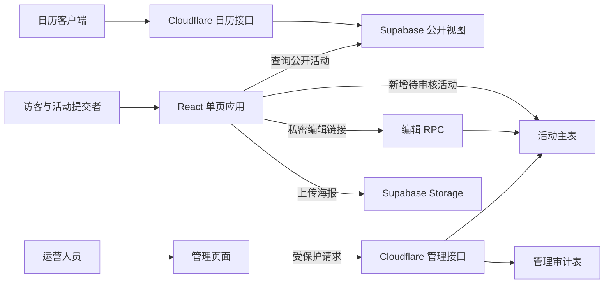

# Datawhale AI+X 活动日历：项目交接与重构说明

整理日期：2026-09-17。本文依据当前工作区代码、仓库文档和本地检查编写，供接手者理解现状、划定重构范围与设计验收。

**项目已经具备活动展示、提交、审核、无账号编辑和日历订阅的实现。重构首先要保住这条业务链路。** 早期文档中的全球聚合、爬虫、邮件周报等内容不能直接当作现有功能。

本文不包含密钥、配置实际值、真实编辑凭据、私人联系方式或生产数据。环境变量仅列名称、用途和使用位置。线上部署、数据库实际结构和运营规模本次均未登录核验；“代码已有”不等于“线上已部署或验证通过”。

## 1. 项目定位与交接基线

面向 AI 学习者、开发者、高校学生、产业从业者和活动组织者，提供 Datawhale AI+X 社区活动的发现、筛选、官方报名导流及日历订阅。组织者可无账号提交活动，运营人员审核后公开。

当前主要内容面向中文社区，提交数据默认使用中国、中文和 `Asia/Shanghai`。虽然早期 PRD 定位是全球科技活动聚合平台，当前实现更接近社区活动平台。

| 项目 | 当前核验结果 |
| --- | --- |
| 包名称 / 版本 | `aix-events` / `0.1.0`，私有包 |
| Git 分支 | `master` |
| GitHub 仓库 | [SuperSupeng/aixevents](https://github.com/SuperSupeng/aixevents) |
| 业务代码基线 | `ab85415`，2026-08-16，修复日历形式筛选时的列表截断；本次交接补充文档与本地产物忽略规则 |
| 代码默认公开域名 | `https://aixevents.datawhale.cn`；属于代码配置，不代表本次确认了线上可用性 |
| 应用形态 | React 单页应用 + Cloudflare Pages Functions + Supabase |
| 普通用户账号 | 未实现账户登录；活动编辑依赖私密编辑链接 |
| 管理员账号 | 当前为共享管理凭据，不是独立用户及角色体系 |

交接版本以原有社区活动功能为准，生态伙伴独立页面仍未开放。此前未提交的试行页面已撤销，相关导航、文案和样式已恢复到业务代码基线。以包含本文的 Git 提交作为完整交接版本。

`outputs/` 是本地生成的表格和截图目录，已加入 `.gitignore`，保留在原电脑但不上传 GitHub；环境文件和依赖、构建产物也不作为代码交付。

## 2. 当前页面与功能

路由集中在 `src/App.tsx`，通过 `window.location`、`history.pushState/replaceState` 和 `popstate` 自行管理，没有使用 React Router。

| 路径 / 入口 | 当前实现 | 重构时需要保留的行为 |
| --- | --- | --- |
| `/`、`/?q=关键词` | 活动首页，月历、周历、列表、推荐位、伙伴 Logo 墙 | 搜索、类型、城市、“全部/线上/线下”筛选，以及加载、空结果、错误提示；数据模型另支持混合形式 |
| `/events/:id` | 可分享的活动详情地址 | 直接访问可加载详情；站内点活动时在原页面上打开弹层，关闭后恢复原 URL 和阅读位置 |
| 提交活动弹窗 | 创建活动，上传海报，提交后显示编辑链接 | 不要求注册；新提交不能直接公开；需要提醒提交者保存编辑链接 |
| `/edit/:token` | 通过私密链接读取和修改提交 | 这里的 `:token` 只是参数名；真实地址不得放入交接资料、公开索引或截图 |
| `/admin` | 审核新提交、审核更新、直接编辑、推荐位管理与排序 | 鉴权必须由服务端执行；前端只能调用受保护的管理接口 |
| `/hackathons` | 黑客松专题，单独获取活动列表 | 按挑战类活动分组规则筛选，活动详情和时间分区可用 |
| `/creators-day` | AI+X 创造节专题 | 独立活动分类和对应提交入口 |
| `/waic-2026` | WAIC 2026 历史专题 | 固定标签和 2026-07-15 至 07-20 日期配置；是否继续保留需按历史内容需求决定 |
| `/partners` | 未开放的生态伙伴入口 | 直接访问会回到首页并显示“即将上线”；导航和 Logo 墙按钮也显示该提示；保留抓取限制 |
| `/join`、`/join?city=城市` | 城市活动群入口与二维码展示 | 城市别名匹配、搜索、默认选择和移动端展示 |
| `/resources` | 资源导航、日历订阅/下载等 | 外部资源与订阅入口有效性需另行检查 |
| `/privacy`、`/terms` | 隐私政策与使用条款 | 内容需与重构后的真实数据收集和功能保持一致 |

当前没有在仓库中发现自动爬虫、自动去重、第三方活动平台导入任务、邮件周报、收藏账户系统、RSS Feed 或通用 `/api/events` 实现。`/about`、`/faq`、`/api/docs` 也不是现有独立页面；未知路径会回到首页，而非专门的 404 页面。

## 3. 架构与代码入口



浏览器会直接调用 Supabase 的公开视图、匿名插入、编辑 RPC 和 Storage，因此数据库权限本身就是应用边界，不能只依赖网页表单校验。管理写入、日历输出及统计接口位于 Cloudflare Pages Functions，服务器凭据不能进入前端构建。

| 位置 | 职责 |
| --- | --- |
| `src/main.tsx` | React 入口、React Query Provider、应用错误边界 |
| `src/App.tsx` | 路由、首页、筛选状态、详情弹层、页面组合；约 1,100 行 |
| `src/pages/` | 专题页、内容页及管理后台；`AdminDashboard.tsx` 约 951 行 |
| `src/components/` | 日历、周历、列表、详情、筛选、提交、订阅等；提交弹窗约 672 行 |
| `src/api/events.ts` | 公开视图查询、筛选及数据库字段到前端对象的转换 |
| `src/api/submissions.ts` | 表单数据规范化、海报上传、创建活动、编辑链接与 RPC |
| `src/api/admin.ts` | 浏览器调用管理接口的请求和响应类型 |
| `src/hooks/` | 活动查询、搜索防抖、历史活动展开和提示状态 |
| `src/types.ts` | 活动、提交、可编辑记录和视图模式类型 |
| `src/constants/activityTaxonomy.ts` | 活动分类、提交分类、筛选组及城市选项 |
| `src/utils/` | 时间、活动分区、标签、日历链接、SEO、站点地址、sitemap 生成函数 |
| `functions/api/` | 日历、统计和旧审核入口；`admin/submissions.ts` 是管理主接口，约 801 行 |
| `database/`、`supabase_rls_setup.sql` | 数据表、公开视图、RPC、RLS、海报存储策略及修复脚本 |
| `public/` | 品牌素材、二维码、伙伴 Logo、静态 sitemap、robots、响应头和路由回退规则 |
| `vite.config.ts` | 构建分包和仅限开发环境的管理接口桥接 |

前端使用 React 18、TypeScript、Vite 5、Tailwind CSS 3、TanStack React Query 5、Supabase JS 2；动画、图标、时间处理分别使用 Framer Motion、Lucide、date-fns。依赖版本以 `package-lock.json` 为可复现安装依据，不能以已有 `node_modules` 推断。

## 4. 数据模型与权限边界

### 核心数据库对象

| 对象 | 用途与迁移注意事项 |
| --- | --- |
| `datawhale_events` | 所有活动及审核状态的主表，同时保存提交人信息、内部备注、编辑凭据哈希、待审核修改 |
| `datawhale_events_public` | 仅返回 `review_status = approved` 的公开字段；不公开提交者、备注、编辑哈希和待修改内容 |
| `datawhale_admin_audit_logs` | 管理操作审计，记录操作者标签、动作、活动、请求信息摘要和元数据 |
| `datawhale-event-posters` | 公开读取的海报桶；JPG/JPEG、PNG、WebP，最大 5 MB |
| `get_datawhale_event_by_edit_token` | 根据编辑凭据读取可编辑记录，包括其待审核更新 |
| `update_datawhale_event_by_edit_token` | 根据编辑凭据保存修改，按是否已公开分成不同状态流 |
| `datawhale_edit_token_hash` | 编辑凭据的 SHA-256 哈希计算 |
| `record_ics_download`、`get_ics_download_stats` | 日历/统计接口引用的 RPC；**仓库没有对应 SQL 定义**，全新环境无法仅靠现有 SQL 完整复建统计功能 |

主表中的主要字段如下，完整定义见 `database/schema.sql`，前端对象见 `src/types.ts`：

| 字段组 | 主要字段 | 说明 |
| --- | --- | --- |
| 基本信息 | `id`、`title`、`summary`、`activity_type` | UUID 标识，活动分类独立于自定义标签 |
| 时间与形式 | `start_time`、`end_time`、`timezone`、`is_all_day`、`format` | 时间为 `TIMESTAMPTZ`；形式为 `online/offline/hybrid` |
| 地点、组织与链接 | `location`、`organizer`、`organizers`、`links` | 多项采用 JSONB；报名和海报链接包含在 `links` 中 |
| 标签与展示 | `tags`、`custom_tags`、`language`、`price` | 前端会提供缺省值，并将 snake_case 转为 camelCase |
| 审核与发布 | `review_status`、`review_note`、`reviewed_at`、`published_at` | `pending/approved/rejected` |
| 待确认修改 | `pending_update`、`update_status`、`update_note` | `none/pending/rejected`；不能与公开字段混用 |
| 推荐 | `is_featured`、`featured_rank` | 当前有效推荐最多 3 个，数字越小越靠前 |
| 内部信息 | `submitter`、`notes`、`edit_token_hash` | 含私人或授权相关信息，不属于公开数据或交接文档附件 |

公开视图还从海报链接派生 `cover_image`，按当前数据库时间计算 `upcoming/live/ended` 状态。前端类型虽然包含 `canceled`，当前主表没有独立的取消状态字段，不应推定已有完整取消活动流程。

匿名及普通角色只能向主表新增满足规则的待审核记录，不能直接读取、更新或删除主表。公开查询改走视图；编辑 RPC 使用 `SECURITY DEFINER` 和编辑凭据校验。当前视图依赖其所有者权限与明确的字段、状态限制，**不能只把视图改成 `security_invoker = true` 而不重新设计主表权限**，否则可能导致公开读取失效。

数据库脚本说明保留旧 `events` 表，但当前代码不以它为活动主数据源。若线上仍有历史对象，应先查明用途，不能因为新表存在就直接删除。

## 5. 必须保留的业务状态流

1. **新增活动**：浏览器生成随机编辑凭据，只把其哈希写入数据库。记录以 `pending` 状态插入，不能设置成已发布或推荐；提交成功后向提交者展示私密编辑链接。
2. **首次审核**：管理员批准后变为 `approved`，才进入公开视图；拒绝则保存审核结果。
3. **编辑尚未发布的活动**：通过编辑 RPC 修改主记录，并重新进入待审核状态。
4. **编辑已发布活动**：修改内容写入 `pending_update`，`update_status` 变为 `pending`；已有公开内容保持原样。管理员批准更新后才覆盖公开字段；拒绝更新应保留原公开内容。
5. **管理员直接编辑**：直接写主记录并清理已有待审核修改；保留原 `review_status`。因此已发布活动的内容立即变化，但待审核/被拒绝活动不会仅因这次编辑自动发布。改成已结束时会取消推荐。
6. **推荐与排序**：只允许推荐已发布、尚未结束的活动；最多 3 个当前有效推荐，排序保存重写 `featured_rank`。界面文案叫“本周推荐”，实现并不要求活动必须发生在本自然周。

迁移必须保留活动 UUID、公开 URL、编辑凭据哈希算法和状态含义。只有哈希无法还原已发出的编辑凭据；不能通过重新生成一批哈希来替代现有记录，否则旧编辑链接将失效。当前没有发现编辑链接到期、找回或轮换机制。

分类也存在业务映射：“交流/分享”包含 `meetup/talk/conference`，“黑客松”包含 `hackathon/competition/demo_day`。提交表单只暴露其中部分分类，旧记录可能仍使用完整分类。重构时应统一复用分类定义，不能只按界面名称机械改数据库值。

## 6. 服务端接口契约

| 接口 | 请求与权限 | 主要结果 / 注意事项 |
| --- | --- | --- |
| `GET /api/calendar` | 公开；参数包括 `eventId`、`format`、`location`、`tags`、`search`、`download=1` | 输出 ICS；响应缓存 1 小时，并声明 1 小时刷新建议；无匹配的列表返回空日历，单个活动不存在返回 404；`tags` 在这里用于活动类型/筛选组 |
| `GET /api/admin/submissions` | 管理凭据；`status`、`q`、`limit` | 返回 `submissions/total/summary/generatedAt`；状态筛选为 `pending/updates/approved/rejected/featured/all`；默认 100 条、最多 200 条，未实现分页游标 |
| `POST /api/admin/submissions` | 管理凭据，JSON 请求体 | `action` 白名单：`approve/reject/update/set_feature/reorder_featured` |
| `/api/review-submission` | 旧兼容入口 | 307 跳转到管理主接口，避免维护两套审核逻辑 |
| `GET /api/stats` | 统计专用凭据，支持 `x-api-key` 请求头 | 调用统计 RPC；代码也兼容 URL 参数传凭据，重构应评估移除该方式以减少日志泄露风险 |

管理接口的主要写入载荷为：审核使用 `submissionId/action/reviewNote`；直接编辑使用 `eventId/action/event`；推荐使用 `eventId/action/isFeatured/featuredRank`；排序使用 `action/eventIds`，其中 ID 列表必须覆盖全部当前有效推荐。

管理前端通过 `Authorization` 请求头传递管理凭据，兼容的备用头由服务端处理。`X-Admin-Actor` 是操作者标签，当前不是经过独立身份认证的账号。凭据只在浏览器 `sessionStorage` 中保存。管理 CORS 限同源、配置站点和显式允许来源，返回 `no-store`；`public/_headers` 配置管理、编辑和隐藏页面的抓取限制。

公开活动查询主要通过 Supabase SDK 完成，`src/api/events.ts` 并不对应一个名为 `/api/events` 的 Cloudflare HTTP 接口。

订阅客户端的实际刷新节奏由客户端决定，审核通过后未必立即显示更新；下载的 ICS 则是一次性快照，不会自动更新。

## 7. 本地运行与部署

### 开发和检查入口

```bash
npm ci
npm run dev
npm run test:seo
npm run build
npm run preview
```

这些命令分别用于按锁文件安装、开发、现有回归检查、类型检查与打包、预览静态构建。现有脚本没有统一 `test` 或 `lint` 命令，`test:seo` 名称虽然包含 SEO，实际还覆盖部分活动展示和后台编辑约束。

配置通过未纳入版本控制的本地环境文件及部署平台环境变量提供。以下仅列变量名称，不提供或复制任何真实值：

| 变量名 | 使用位置 | 用途 |
| --- | --- | --- |
| `VITE_SUPABASE_URL` | 前端构建、服务端接口 | Supabase 项目连接地址 |
| `VITE_SUPABASE_ANON_KEY` | 前端构建 | 受数据库权限约束的客户端访问配置；真实值仍不纳入本文 |
| `VITE_PUBLIC_SITE_URL` | 前端构建、管理接口 | canonical、分享链接和结构化数据的站点地址；管理来源判断 |
| `SUPABASE_SERVICE_ROLE_KEY` | 仅服务端 | 管理、日历和统计接口访问数据库 |
| `REVIEW_ADMIN_TOKEN` | 仅服务端配置，管理界面使用者另行获授权 | 管理接口鉴权 |
| `ADMIN_ALLOWED_ORIGINS` | 仅服务端 | 可选的额外管理来源白名单，逗号分隔 |
| `STATS_API_KEY` | 仅服务端 | 统计接口鉴权 |
| `IP_HASH_SALT` | 仅服务端 | 日历访问与管理审计的 IP 摘要计算 |

**本地开发并不等于全套服务端运行。** Vite 只桥接 `/api/admin/submissions`，没有桥接日历、统计及旧审核入口。`npm run preview` 也不能当作完整 Pages Functions 环境。端到端联调需要单独准备对应运行环境和测试数据库；不能在默认连接生产库的配置上试提交或试审核。

README 记录的部署配置是 Cloudflare Pages：构建命令 `npm run build`、输出目录 `dist`、生产分支 `master`、Node.js 20、Deploy command 留空。此处记录的是仓库原有约定；平台当前实际配置未核验，也未在本次替项目决定升级运行时。

`functions/` 中的源码需作为 Pages Functions 一并部署，单独托管 `dist` 不能提供这些接口。`public/_redirects` 将前端路径回退到 `index.html`；迁移托管平台时必须保留相同的路由直达能力。`VITE_*` 值在构建时注入，改值后需要重新构建。

仓库没有发现 Cloudflare 项目配置文件、完整部署流水线、版本化数据库迁移目录或数据库本地配置。平台项目关联、域名/DNS、环境区分和实际发布方式要由现有负责人通过平台权限交接。

### 数据库脚本使用关系

| 文件 | 作用 |
| --- | --- |
| `database/schema.sql` | 现有活动平台主体初始化：表、视图、编辑 RPC、权限和 Storage；不含上述统计 RPC |
| `supabase_rls_setup.sql` | 修复已有对象的权限与存储策略；依赖表、视图、函数已经存在 |
| `database/datawhale_storage_init.sql` | 独立创建/修复海报桶和存储策略 |
| `database/datawhale_edit_functions_init.sql` | 独立创建/修复编辑函数及执行权限，依赖主表和必要字段已存在 |
| `database/add_admin_update_audit_action.sql` | 为旧环境的审计动作约束补充 `update` |

这些文件有重叠定义，不能视为按编号顺序执行的迁移链。对已有环境应先比对实际结构和已执行变更，再设计迁移；不要用“重新初始化”代替数据迁移与备份。

## 8. 内容和素材维护

首页生态伙伴 Logo 墙读取 `src/data/partners.json`，分类/展示逻辑在 `src/data/partners.ts`，图片位于 `public/partners/edu-alliance/`。维护说明见 `docs/partners-maintenance.md`。`src/pages/Partners.tsx` 保留生态伙伴分类页组件，但当前导航与直接访问均由未开放提示拦截；修改该组件不等于页面已对用户开放。

城市活动群数据和别名在 `src/data/cityGroups.ts`，二维码在 `public/brand/city-groups/`。品牌、活动群及专题素材在 `public/brand/` 等目录；本文只说明维护位置，不复制二维码或联系方式。素材是否过期、机构展示授权和外部资源是否仍有效，本次未做运营核验。

SEO 由 `src/utils/seo.ts` 和页面状态在浏览器中更新。`public/sitemap.xml` 当前是静态页面清单；`src/utils/sitemap.ts` 虽可生成活动详情 URL，但没有发现接入构建或线上接口的调用。不能把“存在生成函数”写成交付了自动更新的活动 sitemap。

## 9. 重构前应优先解决或确认的问题

以下是代码核验及由实现推导的风险，不代表已在线上复现故障。

| 优先级 | 现状与影响 | 接手建议 |
| --- | --- | --- |
| 先确认 | 原工作区部分依赖版本与锁文件不一致；独立副本按锁文件安装已通过检查 | 接手后使用 `npm ci` 建立一致环境，再决定是否升级依赖 |
| 先确认 | 统计 RPC 缺 SQL，部署配置主要依赖平台 | 补齐可复建的数据库和部署资料，明确统计是否保留 |
| 高 | 活动列表默认最多 1,000 条；两个专题各请求最多 300 条；后台最多 200 条且无分页；ICS 也没有显式遍历分页 | 定义分页/日期窗口，验证历史数据增长后展示与订阅仍完整，避免重现截断问题 |
| 高 | 前端表单、管理接口、SQL RPC 分散处理校验，匿名写入和海报上传未见应用级限流 | 建立一致的字段校验与写入边界；在测试环境验证异常输入及滥用控制 |
| 高 | 管理凭据共享，操作者标签来自客户端 | 如需多人独立权限与审计，设计账号和角色，不把现有标签当可信身份 |
| 高 | 审核、审计、推荐计数和排序由多次数据库调用完成 | 审计失败只告警，排序逐条写入；评估事务、并发控制及失败恢复，避免部分成功 |
| 中 | `App.tsx` 同时承担路由、页面、状态、SEO；管理页与提交弹窗也较大 | 按路由、活动查询、表单、审核状态流拆分，保持外部 URL 与业务规则兼容 |
| 中 | WAIC 复用首页当前筛选的活动集合 | 确认历史专题应否独立取数，避免受到首页筛选和列表上限影响 |
| 中 | 提交固定上海时区，多个展示组件使用浏览器本地时间 | 明确产品时区约定，覆盖跨日、跨时区及全天活动，不能宣称已有完整时区切换 |
| 中 | SEO 依赖浏览器运行；活动 sitemap 未自动发布 | 如果重构目标包含收录和社交预览，单独设计可验证的元信息与 sitemap 交付方式 |
| 中 | 某些取数异常返回空数组或空详情 | 区分无数据、缺配置、接口故障与不存在，避免运维问题被显示为空状态 |
| 中 | 海报仅见公开读/上传策略，未见生命周期清理；编辑链接无到期/找回设计 | 明确海报替换后的保留策略与私密编辑链接的持续兼容方案 |

日历统计还需明确口径：订阅请求和下载请求均可能调用记录函数，同时接口有缓存，不能直接把计数解读为独立用户下载量。实际数据库统计函数缺失于仓库，其汇总规则仍需另行核验。

另有一个导航与 SEO 的具体差异：站内点开活动仅更新 URL 与弹层，不将 `currentPage` 切换成 `event`，因此可能保留来源页的标题和 canonical；直接打开同一详情 URL 则会生成活动元信息。这是静态代码推导，本次未在浏览器复现，应加入导航重构的验证范围。

## 10. 本次验证结果及边界

2026-09-17 完成以下核验：

- 逐项核对路由、接口、数据表/视图/RPC、环境变量引用、静态资源、Git 差异与旧文档。
- 初次整理时，在原工作区执行现有检查及 TypeScript/Vite 构建，均通过。
- 撤销试行页面后，在独立临时副本中执行 **`npm ci`、`npm run test:seo`、`npm run build`，全部通过**；9 个测试文件共 **24 项通过，0 项失败**。
- 独立副本未复制环境文件，构建显式使用空的前端连接配置；产物不作为交接附件，也没有替换项目现有部署。
- 使用浏览器检查构建结果：首页正常显示，没有试行页面文案；桌面和手机端导航、首页 Logo 墙的生态伙伴按钮显示“即将上线”；直接打开 `/partners` 返回首页并显示相同提示。没有捕获到页面脚本错误或错误遮罩；仅有未配置 Supabase 的预期警告。

本次使用环境附带的 Node.js **24.19.0** 和 npm **10.9.2** 完成验证。原工作区的依赖目录未修改，初次核验时与锁文件存在以下差异；独立副本的全新安装以锁文件版本为准：

| 依赖 | 当前安装 | 锁文件记录 |
| --- | --- | --- |
| Vite | 5.3.1 | 5.4.21 |
| TypeScript | 5.2.2 | 5.9.3 |
| Supabase JS | 2.110.3 | 2.91.0 |
| TanStack React Query | 5.101.2 | 5.90.19 |

已确认锁文件可以在上述 Node.js 24 环境中全新安装并通过检查；**README 所列 Node.js 20 环境尚未验证**。React 18.3.1 和 Tailwind CSS 3.4.19 的原工作区版本与锁文件一致。构建出现 Browserslist 数据较旧的非阻断提示，本次未为此改动依赖。

现有检查包含纯函数断言，也有直接读取源码并匹配字符串的测试，不能替代完整业务或数据库集成验证。此次浏览器检查使用空数据配置，仅验证相关页面与入口；没有执行生产数据库读写、实际 RLS 授权测试、真实海报上传、审核操作、日历客户端订阅、线上收录或部署验证。

## 11. 建议的重构顺序与验收

建议先建立可复现基线和可用测试环境，再抽离模块、完善数据边界，最后处理界面及依赖升级。新实现是否保留 React/Vite、是否迁移托管平台、是否增加账号体系，应作为明确的重构决策，本文不擅自确定。

第一阶段交付应包括完整代码基线、干净安装验证、测试环境配置说明、数据库对象清单、缺失统计能力的处理决定和迁移/回退方案。第二阶段在保持活动标识、公开 URL、编辑授权及审核含义兼容的前提下拆分路由、查询、表单和后台。第三阶段再实施已确认的体验、权限、规模或 SEO 改进。

在独立测试环境逐项验收：

- [ ] 首屏、月/周/列表切换、组合筛选、搜索、无结果和失败重试可用；数据量超过原上限时不遗漏未来活动。
- [ ] 活动详情可以直达和分享；站内打开、关闭、浏览器前进/后退及滚动位置符合预期。
- [ ] 新提交始终待审核；公开视图与日历订阅都不会泄露未审核或内部字段。
- [ ] 私密编辑链接可继续使用；未发布活动修改后重新待审核；已发布活动修改须经确认才替换公开内容。
- [ ] 批准/拒绝更新保留正确的公开版本；管理员直接编辑保持审核状态并按约定清理待更新内容。
- [ ] 推荐数量、结束时间、排序、并发操作和失败恢复行为明确；审计结果可验证。
- [ ] 海报格式/大小限制、长海报预览、缩放及移动端操作正常。
- [ ] 单活动和筛选订阅内容一致；跨日、时区、中文及特殊字符可被目标日历客户端正确识别。
- [ ] 普通请求不能读取/改写内部表，未授权管理请求被拒绝，服务端配置不会进入浏览器产物或日志。
- [ ] 深层 URL 刷新、canonical、社交分享元信息、sitemap 与隐藏页面抓取策略得到实际验证。
- [ ] 构建、自动检查、数据库迁移演练和回退演练完成；需要保留的历史专题与正式页面均已纳入。

## 12. 还需要负责人补充的交接信息

这些信息应通过平台邀请、权限移交或单独受控渠道处理，不把凭据粘贴到本文：

| 事项 | 需要确认的非敏感结论 |
| --- | --- |
| 代码托管 | 接手仓库、成员权限和最终交接提交 |
| Cloudflare 与域名 | Pages 项目归属、生产/预览环境、域名及 DNS 管理职责、发布与回退方式 |
| Supabase | 项目权限、真实数据库对象与已执行脚本、Storage 内容迁移范围、备份与恢复能力 |
| 统计 | 缺失 RPC 是否在线上存在，数据结构、保留期限，以及重构后是否继续保留 |
| 内容运营 | 谁审核活动、谁维护城市群和伙伴资料、历史专题是否归档 |
| 重构目标 | 优先解决的具体问题、必须保留的功能、可调整内容、时间安排和验收负责人 |

活动数量、用户量、访问量、审核积压、运行费用、线上故障率和备份状态均无法从仓库可靠确认，本文不提供推测数字。

## 13. 原有资料的使用方式

| 资料 | 定位 |
| --- | --- |
| `README.md` | 启动、部署和主要流程入口；结合本文对统计缺口、本地桥接与验证边界的补充阅读 |
| `SECURITY_CHECKLIST.md` | 当前权限模型和待验证安全行为；作为验收依据，不等于已在线上全部验证 |
| `docs/partners-maintenance.md` | 当前伙伴素材维护说明，区分首页 Logo 墙与尚未开放的独立页面 |
| `PRD.md` | 2026-01 的早期全球活动聚合规划，与当前社区定位存在差异 |
| `docs/content-pages.md`、`docs/geo-strategy.md` | 历史内容和增长方案；其中 API、RSS、自动抓取及规模数字不能当作当前事实 |
| `docs/google-search-console-setup.md` | 历史设置建议，包含未接入的动态 sitemap 示例，不证明线上已配置 |
| `docs/discord-community-setup.md` | 社区运营建议，不证明相应社区规模和自动化已经实现 |

接手时建议依次阅读本文、README、`src/App.tsx`、`src/api/`、`functions/api/admin/submissions.ts`、`database/schema.sql` 和现有测试；业务现状以当前代码、经核验的线上配置及负责人确认共同确定。
